<div align="center">

  

  # 🎙️ Pika AI — Desktop Assistant

  **A sleek, modern, voice-controlled Desktop Assistant built with React (Vite) & Python**

  Control your PC • Offline Hindi/English Voice Recognition • Chat with top LLMs

  [](https://vite.dev/)
  [](https://react.dev/)
  [](https://python.org/)
  [](https://tailwindcss.com/)
  [](LICENSE)
  [](https://github.com/SudhirDevOps1/pika-ai-assistant/stargazers)

</div>

---

## 📖 Table of Contents

- [🌟 Features](#-features)
- [📸 Screenshots](#-screenshots)
- [🚀 Quick Start Guide](#-quick-start-guide)
- [⚙️ Configuration](#%EF%B8%8F-configuration)
- [💻 PC Bridge Capabilities](#-pc-bridge-capabilities)
- [🤖 AI Providers Comparison](#-ai-providers-comparison)
- [🛠️ Tech Stack](#%EF%B8%8F-tech-stack)
- [📁 Project Structure](#-project-structure)
- [🔧 Troubleshooting](#-troubleshooting)
- [🗺️ Roadmap](#%EF%B8%8F-roadmap)
- [🤝 Contributing](#-contributing)
- [📄 License](#-license)
- [👤 Author](#-author)

---

## 🌟 Features

| Feature | Description |
|---------|-------------|
| 🎤 **Offline Voice Recognition** | Vosk-based Hindi & English speech-to-text — works without internet |
| 💬 **AI Chat** | Chat with Groq, Google Gemini, Mistral, Cerebras, DeepSeek, or OpenRouter LLMs |
| 💻 **PC Control** | Volume, Apps, Shutdown, Media, Screenshot — all from your browser |
| 🔔 **Smart Reminders** | Set timers with desktop notifications |
| 📋 **Clipboard Manager** | Track & reuse your copy history |
| 📊 **System Monitor** | Real-time CPU, RAM, Battery, Disk usage |
| 📱 **Cross-Device** | Access from your phone on the same WiFi |
| 🎨 **Glassmorphism UI** | Premium dark-mode interface with animations |
| ⚡ **One-Click Start** | Double-click `start.bat` (Windows) or run `start.sh` (Mac/Linux) — frontend + backend start together |
| 🔄 **Auto Fallback** | If one AI provider fails, switches to another automatically |
| 🌐 **Web Search** | Google, YouTube, GitHub, StackOverflow search from UI |
| 🪟 **Window Control** | Minimize, Maximize, Close, Switch windows remotely |
| 🔆 **Brightness Control** | Adjust screen brightness from the UI |
| 📶 **WiFi Manager** | Turn WiFi On/Off, List, connect, disconnect WiFi networks |
| ⌨️ **Keyboard Shortcuts** | Send any hotkey remotely (Ctrl+C, Alt+Tab, etc.) |
| 📁 **File Manager** | Create, edit (write/append), delete, list, search, copy, move files/folders |
| 📺 **PiP Floating Window** | Draggable Picture-in-Picture status widget with live command logging |
| 🎛️ **Manual Engine Select** | Independently toggle between online/offline STT and TTS configurations |
| 📷 **Camera Control** | Launch default system Camera app via voice/button |
| 📝 **Code Syntax Highlighting** | Built-in PrismJS Tomorrow theme formatting for code blocks in chat logs |
| 📉 **Token Usage Tracker** | Live API usage dashboard tracking total prompt and completion token counts |

> 📖 **Want to read more about the features?** Check out the [Detailed Features & Advanced Systems](docs/features.md) document.

---

## 📸 Screenshots

> 💡 **Add your screenshots here!** Take screenshots of your app and place them in the `public/screenshots/` folder.

<div align="center">

| Chat Interface | PC Control Panel |
|:-:|:-:|
|  |  |
| **Settings Page** | **System Monitor** |
|  |  |

</div>

---

## 🚀 Quick Start Guide

### 📋 Requirements

| Software | Version | Download |
|----------|---------|----------|
| **Node.js** | v18+ | [nodejs.org](https://nodejs.org/) |
| **Python** | v3.10+ | [python.org](https://www.python.org/) |
| **npm** | (comes with Node) | — |
| **pip** | (comes with Python) | — |
| **Browser** | Chrome / Edge / Firefox | Any modern browser |

### 📦 First-Run Download & Disk Footprint

When you start the application for the first time, dependencies and offline models are downloaded automatically. Here is the breakdown:

| Component | Network Download Size | Disk Space Occupied (Extracted) | Purpose |
|:---|:---:|:---:|:---|
| **Node.js dependencies (`node_modules`)** | ~50 MB | ~180 MB | Runs the Vite React Frontend UI |
| **Python Virtual Environment (`venv`)** | ~30 MB | ~110 MB | Installs bridge libraries (pyautogui, edge-tts, etc.) |
| **Vosk Hindi Speech Model (`models/hi`)** | ~45 MB | ~55 MB | Enables 100% local, offline Hindi voice recognition |
| **TOTAL INITIAL FOOTPRINT** | **~125 MB** | **~345 MB** | **Smooth, lightweight, and fully production-ready** |

> [!NOTE]
> The Vosk model download of **~45 MB** is a one-time process that triggers automatically on running `start.bat` only if you choose to use the local offline speech engine.

### 🔑 API Key (Any ONE)

| Provider | Link | Free? | Speed |
|----------|------|-------|-------|
| **Groq** ⭐ Recommended | [console.groq.com](https://console.groq.com) | ✅ Yes | ⚡⚡⚡ Ultra Fast |
| **Google Gemini** | [aistudio.google.com](https://aistudio.google.com) | ✅ Yes | ⚡⚡ Fast |
| **Mistral** | [console.mistral.ai](https://console.mistral.ai) | ✅ Yes | ⚡⚡ Fast |
| **Cerebras** | [cloud.cerebras.ai](https://cloud.cerebras.ai) | ✅ Yes | ⚡⚡⚡ Ultra Fast |

## 📥 Installation

### Prerequisites

Make sure the following are installed on your system:

- **Node.js** 18+ ([download](https://nodejs.org/))
- **Python** 3.10+ ([download](https://python.org/))
- **Git** ([download](https://git-scm.com/))

### 🚀 Quick Setup

```bash
# 1. Clone the repository
git clone https://github.com/SudhirDevOps1/pika-ai-assistant.git
cd pika-ai-assistant

# 2. Start using start scripts (They auto-install and setup everything including Virtual Environment)
```

### ▶️ Running the Assistant

**Option 1 — One Click (Recommended):**
* **Windows**: Just double-click the **`start.bat`** file in the root folder.
* **Mac/Linux**: Open terminal and run **`./start.sh`**.

This will automatically:
1. Create a Python Virtual Environment (`venv`) if it doesn't exist
2. Install and update all Node and Python dependencies
3. Start the Web UI on `http://localhost:3000`
4. Start the Python PC Bridge on `ws://localhost:8765`
5. Print a scan-ready QR code to sync your mobile devices instantly

**Option 2 — Manual Startup:**

If you prefer starting components manually:

```bash
# Terminal 1 — Python PC Bridge
# Windows
venv\Scripts\python.exe pc_bridge.py
# macOS / Linux
./venv/bin/python pc_bridge.py

# Terminal 2 — Frontend Web Server
npm run dev
```

Then open **http://localhost:3000** in your browser.

### 📱 Phone Access

Connect your phone to the **same WiFi** as your PC, then scan the QR code printed in the terminal launcher, or navigate to:

```bash
http://YOUR_PC_IP:3000
```

---

## ⚙️ Configuration

1. Open [http://localhost:3000](http://localhost:3000) in your browser
2. Go to **Settings** ⚙️ in the sidebar
3. **Select Provider** — choose Groq/Gemini/Mistral/Cerebras
4. **Paste API Key** — in the provider's API key field (can also configure directly in `.env`)
5. **PC Bridge URL** — set to `ws://localhost:8765` (automatically maps to LAN IP when loaded from mobile)
6. Click **Save Settings** ✅
7. Start chatting or use voice commands!

---

## 💻 PC Bridge Capabilities

The Python Bridge (`pc_bridge.py`) runs on your PC and accepts WebSocket commands from the Web UI.

### Architecture

```
┌─────────────┐     WebSocket      ┌─────────────────┐     ┌──────────────┐
│   Web UI    │◄──────────────────►│  Python Bridge   │────►│   PC Actions │
│  (Browser)  │  ws://localhost:    │  (pc_bridge.py)  │     │              │
│  :3000      │      8765          │  :8765           │     │  Volume,Apps │
└─────────────┘                    └─────────────────┘     │  Shutdown,etc│
                                                            └──────────────┘
```

### Features (16 Categories)

| Category | Commands |
|----------|----------|
| ⚡ **System** | Shutdown, Restart, Sleep, Lock, Log Off, Hibernate |
| 🔊 **Volume** | Up, Down, Mute, Unmute, Set Level |
| 🎵 **Media** | Play/Pause, Next Track, Previous Track |
| 📱 **Apps** | Open/Close Chrome, VS Code, Notepad, Calculator, 25+ apps |
| 🌐 **URL** | Open any URL in browser |
| 🪟 **Windows** | Minimize, Maximize, Close, Switch, Show Desktop |
| 📊 **System Info** | CPU, RAM, Disk, Battery, IP, Uptime, LAN IP |
| 📋 **Clipboard** | Get, Set, Paste clipboard content |
| 📁 **Files** | Create, Delete, List files and directories, Rename |
| 📸 **Screenshot** | Take screenshot, save to desktop, stream to UI |
| ⏰ **Reminders** | Set timed reminders with notifications |
| 🔔 **Notifications** | Send custom system notifications |
| ⌨️ **Keyboard** | Send any keyboard shortcut remotely |
| 🔆 **Brightness** | Get/set screen brightness |
| 📶 **WiFi** | List networks, Connect, Disconnect |
| 🔍 **Search** | Google, YouTube, GitHub, StackOverflow, Wikipedia |

---

## 🤖 AI Providers Comparison

| Provider | Best Models | Speed | Free? | Best For |
|----------|-------------|-------|-------|----------|
| 🟠 **Groq** | Llama 3.3 70B, DeepSeek R1 | ⚡⚡⚡ Ultra | ✅ Yes | General use, fast replies |
| 🔵 **Gemini** | Gemini 2.5 Flash, 2.0 Flash | ⚡⚡ Fast | ✅ Yes | Complex reasoning, coding |
| 🟢 **Mistral** | Mistral Large, Codestral | ⚡⚡ Fast | ✅ Yes | Coding, multilingual |
| 🟣 **Cerebras** | Llama 3.3 70B, Qwen 2.5 | ⚡⚡⚡ Ultra | ✅ Yes | Speed, batch processing |

> 🏆 **Recommendation:** Beginners ke liye **Groq + Llama 3.3 70B** best hai — free, fast, aur smart!

---

## 🛠️ Tech Stack

### Frontend
- **Vite 7** + **React 19**
- **Tailwind CSS 3**
- **Zustand** (State Management)
- **Lucide React** (Icons)
- **PrismJS** (Syntax Highlighting)

### Backend Bridge
- **Python 3.10+** (Bridge server runtime)
- **WebSockets** (Real-time communications)
- **PyAutoGUI** (Keyboard & mouse automation)
- **Psutil** (System telemetry)
- **Pyperclip** (Clipboard sync)
- **Pillow** (Screenshot capture)

### Voice
- **Vosk** (Offline speech-to-text: Hindi + English)
- **Web Speech API** (TTS voice feedback)

---

## 📁 Project Structure

```
Ai-assistant-pika/
│
├── 📄 start.bat                 # One-click startup (Windows)
├── 📄 start.sh                  # One-click startup (Linux/Mac)
├── 📄 start.py                  # Cross-platform startup launcher
├── 📄 index.html                # Main HTML entry point
├── 📄 package.json              # Node.js dependencies
├── 📄 tsconfig.json             # TypeScript configuration
├── 📄 vite.config.ts            # Vite configuration
├── 📄 tailwind.config.ts        # Tailwind CSS configuration
├── 📄 .env.example              # Environment variables template
├── 📄 .gitignore                # Git ignore files configuration
├── 📄 README.md                 # This documentation file
├── 📄 fixes_summary.txt         # Audited fixes and changes report
│
├── 📁 public/
│   ├── logo.svg                 # App logo
│   └── screenshots/             # UI screenshots folder
│
├── 📁 src/
│   ├── 📁 components/           # UI elements (Chat, HUD, Settings, Reminders)
│   ├── 📁 hooks/                # Custom React hooks (useAssistant, useVoice)
│   ├── 📁 lib/                  # Utilities (commandEngine, utils)
│   ├── 📁 store/                # Zustand store (assistantStore)
│   └── 📁 types/                # TypeScript interface definitions
│
├── 📄 pc_bridge.py              # Python WebSocket server
├── 📄 test_bridge.py            # Local backend verification script
└── 📄 requirements.txt          # Python dependencies
```

---

## 🔧 Troubleshooting

### ❌ "No API key configured"
**Fix:** Settings → Paste your API Key → Save Settings. Get a key from: [console.groq.com](https://console.groq.com) (free).

### ❌ PC Control / Command Execution not working
**Fix:** Check these:
- ✅ Python bridge is running (`python pc_bridge.py` or through `start.bat`)
- ✅ Settings Bridge URL has `ws://localhost:8765`
- ✅ You saved the settings.
- ✅ Windows Firewall allows local port 8765 connectivity.

### ❌ npm install fails
```bash
rmdir /s /q node_modules
del package-lock.json
npm install
npm run dev
```

### ❌ Port 3000 already in use
```bash
npx kill-port 3000
npm run dev
```

### ❌ Python bridge Unicode error on startup
We already fixed CP1252 charmap encoding bugs inside `pc_bridge.py` and `test_bridge.py`. Ensure virtual terminal UTF8 support is enabled on your terminal client.

> 📖 **For a full list of audited issues and applied code changes, check out:**
> * [Discovered Codebase Issues & Technical Causes](docs/issues.md)
> * [Implemented Solutions & Codebase Fixes](docs/fixes.md)

---

## 🗺️ Roadmap

### ✅ v4.0.0 (Current)
- [x] Multi-provider AI chat (DeepSeek, Groq, Gemini, Mistral, Cerebras)
- [x] Live system telemetry (CPU/RAM/Battery/Drives)
- [x] PC Bridge with 16 command categories
- [x] Offline Vosk voice recognition
- [x] One-click `start.bat` & `start.sh` launchers with ANSI colors
- [x] Code Syntax Highlighting via PrismJS
- [x] API Token Usage dashboard widget
- [x] Mobile QR sync connection support

### 🔜 v5.0.0 (Planned)
- [ ] Electron desktop app packaging (.exe installer)
- [ ] Docker support
- [ ] Custom wake word training
- [ ] Multi-language UI (Hindi/English toggle button)
- [ ] Voice cloning / custom TTS voices

> 📖 **Check out the detailed future roadmap and development plans:**
> * [Future Roadmap & Extensions](docs/roadmap.md)

---

## 🤝 Contributing

Contributions are welcome! Here's how:

1. **Fork** this repository
2. **Clone** your fork:
   ```bash
   git clone https://github.com/YOUR_USERNAME/pika-ai-assistant.git
   ```
3. **Create** a branch:
   ```bash
   git checkout -b feature/amazing-feature
   ```
4. **Make** your changes
5. **Commit**:
   ```bash
   git commit -m "Add amazing feature"
   ```
6. **Push**:
   ```bash
   git push origin feature/amazing-feature
   ```
7. **Open** a Pull Request

---

## 📄 License

This project is licensed under the **MIT License** – see the [LICENSE](LICENSE) file or content below for details:

```text
MIT License

Copyright (c) 2026 SudhirDevOps1

Permission is hereby granted, free of charge, to any person obtaining a copy
of this software and associated documentation files (the "Software"), to deal
in the Software without restriction, including without limitation the rights
to use, copy, modify, merge, publish, distribute, sublicense, and/or sell
copies of the Software, and to permit persons to whom the Software is
furnished to do so, subject to the following conditions:

The above copyright notice and this permission notice shall be included in all
copies or substantial portions of the Software.

THE SOFTWARE IS PROVIDED "AS IS", WITHOUT WARRANTY OF ANY KIND, EXPRESS OR
IMPLIED, INCLUDING BUT NOT LIMITED TO THE WARRANTIES OF MERCHANTABILITY,
FITNESS FOR A PARTICULAR PURPOSE AND NONINFRINGEMENT. IN NO EVENT SHALL THE
AUTHORS OR COPYRIGHT HOLDERS BE LIABLE FOR ANY CLAIM, DAMAGES OR OTHER
LIABILITY, WHETHER IN AN ACTION OF CONTRACT, TORT OR OTHERWISE, ARISING FROM,
OUT OF OR IN CONNECTION WITH THE SOFTWARE OR THE USE OR OTHER DEALINGS IN THE
SOFTWARE.
```

---

## 👤 Author

<div align="center">

**SudhirDevOps1**

[](https://github.com/SudhirDevOps1)
[](https://github.com/SudhirDevOps1/pika-ai-assistant)

</div>

---

<div align="center">

**⭐ If you like this project, give it a star on GitHub! ⭐**

Made with ❤️ using React 19 + Vite 7 + Python

</div>
